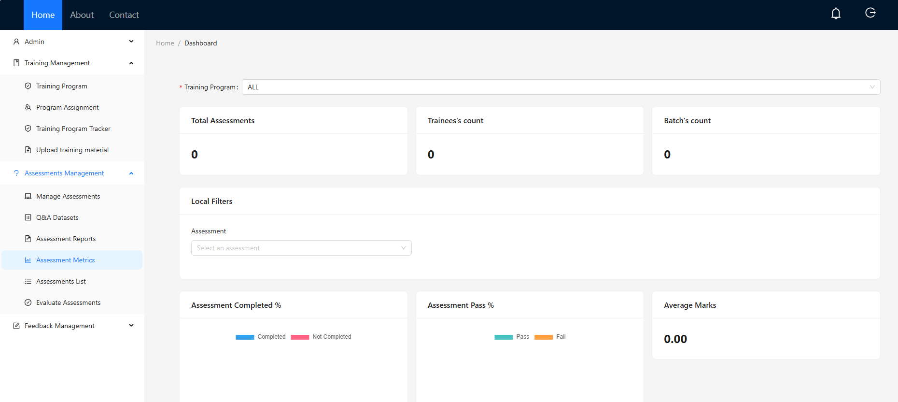

# **Assessment System**

## **Overview**

  Assessment System is a comprehensive application designed to streamline and optimize training and assessment processes within organizations. Supporting both technical and non-technical training programs, it enables efficient management of training sessions, assessments, and performance evaluations.

### **Key features include:**

- Batch-level and organization-wide training assignments

- Post-training assessments with flexible question formats

- Performance metrics evaluation and detailed reporting

- Feedback sharing between trainees and trainers

- Robust management of trainers, trainees, coordinators, and administrative roles

- Integration with organizational Active Directory and AWS S3 for document management

| Layer              | Technology                         |
|--------------------|----------------------------------|
| Frontend           | React.js with Ant Design Pattern |
| Backend            | Node.js with Express server      |
| Databases          | PostgreSQL, MongoDB              |
| Document Management| AWS S3 Bucket                    |

## **User Roles and Use Cases**

### 1. Admin

**Responsibilities:**

- Oversee batch and group management  
- Manage departments and sync records with organization's Active Directory (AD)

**Key Functions:**

- Manage incoming employee batches and split them across departments  
- Assign user roles (Coordinator, Trainee, Trainer) with corresponding privileges  
- Maintain dynamic department records, handling transfers and exits

**Not Responsible For:**  
Direct training or assessments

---

### 2. Coordinator

**Responsibilities:**

- Plan and manage training programs  
- Assign trainers and trainees  
- Conduct and oversee assessments

**Key Functions:**

- Create training programs with detailed plans, schedules, and resources  
- Assign trainers and trainees at organization and department levels  
- Arrange assessments with customizable question sets and evaluation criteria  
- Analyze training effectiveness through performance metrics

**Not Responsible For:**  
Delivering training content directly

---

### 3. Trainer

**Responsibilities:**

- Manage training session progress  
- Prepare Q&A datasets for assessments  
- Manually evaluate assessment results as needed

**Key Functions:**

- Track session attendance and upload reference materials  
- Create various question types (MCQs, multiple selections, coding editors)  
- Review and update assessment scores with feedback comments

**Not Responsible For:**  
Assigning trainees or scheduling assessments

---

### 4. Trainee

**Responsibilities:**

- Attend assigned assessments  
- Provide feedback on training and trainers  
- Review assessment results and download reports  
- Access training materials and upload mock projects for evaluation

**Key Functions:**

- Participate in assessments with clear pass/fail criteria  
- Share feedback that trainers can access  
- Access training content and upload project files for review

**Not Responsible For:**  
Creating training programs or managing user groups


## **Getting Started**

Follow these steps to set up and run the Assessment System application locally:

### Prerequisites

- Node.js (v14 or higher recommended)  
- npm (comes with Node.js)  
- PostgreSQL database  
- MongoDB instance  
- AWS S3 account and bucket  

### Setup Instructions

#### Clone the repository:

```bash
git clone https://github.com/naren/assessment_system.git
```
(Recommended: Use Visual Studio Code for development)

### Project structure:
- frontend/ — React.js client app

- backend/ — Node.js Express server

Install dependencies:

Open terminal and run these commands

- For frontend:
```bash
cd frontend
npm install
```
- For frontend:

```bash
cd backend
npm install
```

- Create .env files in both frontend and backend directories.

    - Backend .env example:
        ```bash
        PORT=5000
        DB_HOST='xxx.xx.x.xx'
        DB_PORT=5432
        DB_USER='postgres'
        DB_PASSWORD='yourpassword'
        DB_NAME='assessment'
        MONGODB_URL='mongodb://xxx.xx.x.xx:27017'
        AWS_ACCESS_KEY_ID='your-access-key'
        AWS_SECRET_ACCESS_KEY='your-secret-key'
        S3_BUCKET_NAME='your-s3-bucket-name'
        SECRET_KEY='your-encryption-secret-key'
        AWS_REGION='us-east-1'
      ```
    - Frontend .env example:
      ```bash
      REACT_APP_BASE_URL=http://localhost:5000/
      ```
- Run the backend server:
  ```bash
  cd backend
  node ./bin/www
  ```
- Run the frontend:
  ```bash
  cd frontend
  npm start
  ```
- Open your browser and navigate to:
  -   ```bash http://localhost:3000 ```

## **Screenshots**

- Landing Page
  
  

- Admin - Group Page
  
  

  - Coordinators - Group Page
  
  

  -  Trainers - Group Page
  
  

  - Batches page
  
  

    - Bulk insertion of batches
  
  
  
  - Program Management
  
  

  - Program assignment
  
  

  - Upload Training Materials
  
  


  - Manage Assessments
  
  

  - Q&A Dataset
  
  

    - Assessments Report
  
  

    - Assessment Metrics
  
  
